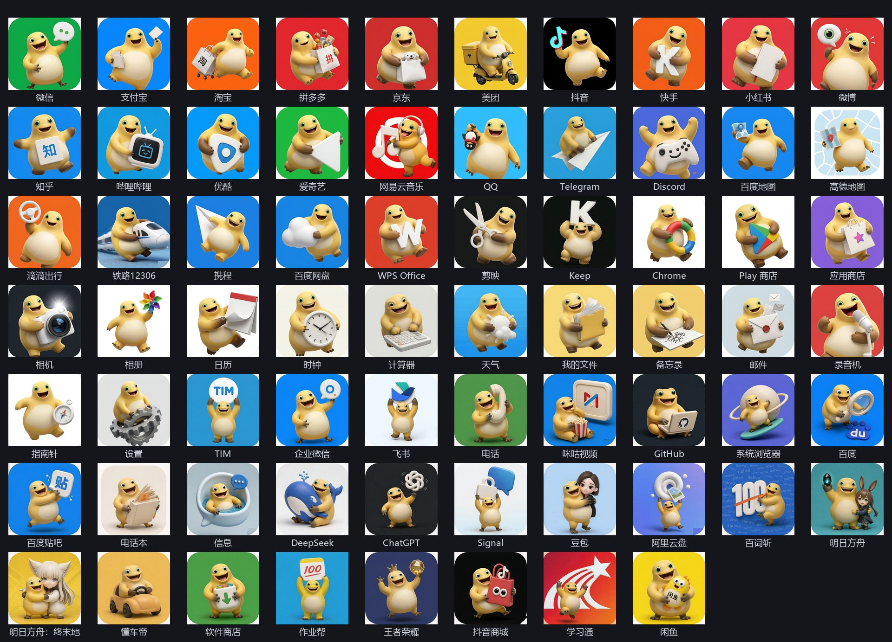

# 奶蛙图标 · Naiwa Icons

<p align="center">
  <br>
  <b>67 个常用应用的安卓图标，每个都是品牌色圆角底，加一只咧嘴狂笑的 3D 黏土奶蛙，抱着这个 App 的核心元素</b>
</p>

<p align="center">
  <a href="https://github.com/chromoany/naiwa-icons-app/releases/latest"></a>
  
  
  <a href="#%E8%AE%B8%E5%8F%AF%E8%AF%81"></a>
  <a href="https://github.com/chromoany/naiwa-icons-app/releases"></a>
  <a href="https://github.com/chromoany/naiwa-icons-app/issues"></a>
</p>

<p align="center">
  <a href="https://github.com/chromoany/naiwa-icons-app/releases/latest"><b>下载最新版 APK</b></a>
  ·
  <a href="#%E6%80%8E%E4%B9%88%E7%94%A8%E4%B8%A4%E7%A7%8D%E6%96%B9%E5%BC%8F">怎么用</a>
  ·
  <a href="#%E5%90%84%E5%93%81%E7%89%8C%E6%89%8B%E6%9C%BA%E6%80%8E%E4%B9%88%E7%94%A8">各品牌手机</a>
  ·
  <a href="#%E5%B8%B8%E8%A7%81%E9%97%AE%E9%A2%98">常见问题</a>
  ·
  <a href="ICONS.md">图标清单</a>
</p>



> 想省事就直接下上面那个 APK。安装时手机提示「禁止安装未知应用」就选允许，装好打开 App，在网格里挑图标钉到桌面。不用 root，也不用连电脑。

> English · Naiwa Icons (奶蛙图标) is a custom-designed icon pack for Android: 67 app icons in a soft 3D clay style, plus a tiny app that applies them to your home screen.
> Download the latest `naiwa-icons-v*.apk` from [Releases](https://github.com/chromoany/naiwa-icons-app/releases/latest), Android 8.0+, free, no ads, no network permission.
> The 1024×1024 artwork and the design spec live in [chromoany/naiwa-icons](https://github.com/chromoany/naiwa-icons).
> This document is in Chinese because the app targets Chinese users: the per-brand instructions (Xiaomi / OPPO / vivo / Huawei / Honor / Samsung) are specific to Chinese ROMs, whose launcher restrictions differ a lot from stock Android.

---

## 这套图标是什么样的

> 装之前先确认两件事：系统是 Android 8.0 及以上；不是 HarmonyOS 5 / NEXT（纯血鸿蒙），那种系统装不了安卓应用，本 App 也用不了。

67 枚图标用的是同一只奶蛙、同一套黏土渲染，摆在桌面上是一整套，不是东拼西凑来的。换图标有两种方式：一个个换，什么手机都能用；桌面支持图标包时，一次全换。

App 没申请联网权限，也就谈不上收集数据。图标做了自适应，圆形、方圆形、圆角方形这三种桌面遮罩下都显示正常。

每枚图标是完整的一大张图，不是透明前景加系统背板，所以品牌色和构图都能自己控制。

## 下载

[点这里下载最新版 APK](https://github.com/chromoany/naiwa-icons-app/releases/latest)，在 Release 页面点 `naiwa-icons-v*.apk`。

| 项目 | 说明 |
|---|---|
| 文件 | `naiwa-icons-v*.apk`，约 3 MB |
| 系统要求 | Android 8.0 及以上（绝大多数手机都满足） |
| 权限 | 只读取已安装应用列表（`QUERY_ALL_PACKAGES`），不申请联网权限，也不上报任何数据 |
| 收费 | 免费，无广告 |
| 升级 | 直接覆盖安装即可，不用卸载 |

> 手机上下载不方便的话，就在电脑上点上面的链接，把 APK 传到手机（微信、QQ 传文件，或者数据线都行），再在手机上点开安装。

## 安装

1. 在手机上点开下载好的 APK
2. 系统一般会拦一下，提示「未知来源」「未经安全审核」「有风险」之类。所有非应用商店来源的安装包都会这样，不是这个 App 有问题，按提示放行就行（各品牌的具体开关位置见[各品牌手机怎么用](#各品牌手机怎么用)）
3. 装完打开「奶蛙图标」

装不上的话，先看这几条。

谁打开的安装包，就给谁开权限。浏览器点开的给浏览器开，文件管理点开的给文件管理开，微信里点开的给微信开。九成的「装不上」都卡在这儿。

找不到「安装未知应用」这个开关，直接在设置的搜索框里搜「未知」两个字。

在微信、QQ 里点下载链接常常拿不到完整的包。点右上角「⋯」→「在浏览器中打开」，再用浏览器下载。

## 怎么用（两种方式）

两条路都在同一个 App 里，随时可以换着用。

### 方式 A · 钉快捷方式（先试这个，什么手机都能用）

安卓不允许一个 App 去改别的 App 的图标，所以流程是往桌面上加一个带新图标的快捷方式，你再把旧图标删掉。所有换图标 App 都是这么做的，不是出了问题。

1. 打开「奶蛙图标」，点一个应用（比如微信）
2. 在弹出的图标缩略图里挑一张
3. 系统弹出「是否添加」，点「添加」
4. 回到桌面：新图标出现了，长按原来那个旧图标删掉即可

- 什么手机都能用，不用装别的东西
- 每个应用要手动做一次；快捷方式收不到角标红点，点开是正常用的
- 点完桌面毫无反应的话，是系统没给「创建桌面快捷方式 / 主屏幕快捷方式」权限，去 设置 → 应用 → 应用管理 → 奶蛙图标 → 权限 里打开（各品牌路径见下）

### 方式 B · 图标包模式（一次全换，得看桌面支不支持）

需要桌面支持第三方图标包。OPPO、一加、realme 的自带桌面直接支持，一次换掉全部能匹配的应用，角标红点都在。其他品牌多数要装 Lawnchair 之类的第三方桌面，而小米、华为、荣耀官方禁止换默认桌面，走不通，具体见下一节。

1. 桌面设置里找到「图标 / 图标样式 / 图标包」，选「奶蛙图标」
2. 全部应用一次换好；个别没换上的，用方式 A 或者桌面自带的换图标入口补齐

> 想改回原样：图标包模式在桌面设置里把图标包切回「系统默认」即可；快捷方式模式删掉新图标，再把原来的图标从应用抽屉拖回桌面。App 也可以直接卸载，不影响系统。

## 各品牌手机怎么用

在下表里找到你的手机，按「推荐路径」那一列做，每个品牌的详细步骤在下面。

| 品牌 / 系统 | 推荐路径 | 一句话说明 |
|---|---|---|
| 小米 / 红米（澎湃 OS、MIUI） | 快捷方式模式 | 系统不许换桌面，图标包模式走不通 |
| OPPO / 一加 / realme（ColorOS） | 图标包模式（自带桌面就能读） | 唯一一个系统桌面直接支持图标包的国产品牌 |
| vivo / iQOO（OriginOS） | 快捷方式模式 | 想一次全换得先去设置里开「允许更换桌面」总闸 |
| 华为（EMUI、HarmonyOS 4 及以下） | 快捷方式模式 | 图标包模式走不通；纯血鸿蒙根本装不了本 App |
| 荣耀（MagicOS） | 快捷方式模式 | 图标包模式走不通 |
| 三星（One UI） | 快捷方式模式 | 先关「自动拦截程序」，否则 APK 装都装不上 |
| 其他安卓 / 原生（Pixel、类原生） | 两种都能用，图标包模式最省事 | 没有品牌限制，一次换掉全部图标 |

装完之后不放心，可以把纯净模式、自动拦截程序重新打开。它们拦的不只是本 App，别的来源也一样拦。

> 安装时有两个高频坑：谁打开的安装包就给谁开权限；找不到「安装未知应用」开关，就在设置里搜「未知」。见上一节[安装](#安装)。

<details>
<summary><b>点开看完整的分品牌步骤（小米 / OPPO 一加 / vivo / 华为 / 荣耀 / 三星 / 原生系统）</b></summary>

### 小米 / 红米（澎湃 OS、MIUI）

装 APK：设置 → 隐私与安全 → 隐私 → 其他权限 → 特殊权限设置 → 安装未知应用，选中你用来打开安装包的那个 App，打开「允许来自此来源的应用」。

安装时看到「无法识别应用备案情况」「应用未上架」都是正常的，点「已了解此应用存在风险」→「仍然安装」即可。

还是装不上就先关纯净模式：设置 → 应用设置 → 纯净模式 → 关闭。安装界面右上角也有开关，可以只放行这一次。

换图标只能用快捷方式模式。点了「钉快捷方式」桌面毫无反应，是少了权限：设置 → 隐私与安全 → 其他权限 → 奶蛙图标 → 打开「主屏幕快捷方式」，选「始终允许」。

图标包模式走不通。小米官方明确禁止把第三方桌面设为默认桌面，装了 Lawnchair 也会一按 Home 键就跳回系统桌面。

个别红米机型即使关掉「安全守护」「应用安全验证」仍然禁止安装，可以再关掉 手机管家 → 设置 → 病毒扫描 → 安装监控。

### OPPO / 一加 / realme（ColorOS 14 / 15）

装 APK：设置 → 密码与安全 → 系统安全 → 外部来源应用。ColorOS 里这个权限就叫「外部来源应用」，搜「安装未知应用」可能搜不到；找到用来打开安装包的那个 App，打开开关。

安装时弹「未经 OPPO 安全审核」，勾选「已知悉该应用存在风险」→「无视风险安装」；中途要求输锁屏密码或指纹是正常的。

换图标推荐用图标包模式。ColorOS 自带桌面就能读第三方图标包，不用装别的桌面：长按桌面空白处（或双指捏合）→ 桌面设置 → 图标 → 选「奶蛙图标」，一次换掉所有能匹配的应用，角标也在，同一个页面里一般还能只替换某一个应用的图标。系统的图标选择器没有搜索、列表有时还加载不全，图标一多只能靠肉眼翻；长按图标出来的「编辑」多数版本只能改名字，换图标的入口在上面那条路径里。

别装 Lawnchair 这类第三方桌面，ColorOS 上切过去容易出现按 Home 键在两个桌面之间来回跳的情况，等于用不了。

从微信收到的 APK 会被改名藏起来，去「文件管理 → 微信 → 其他」里找到它，把多余的 `.1` 之类后缀去掉再装。

一加和 realme 的操作与 OPPO 基本一样，只是设置里个别叫法略有差别。

### vivo / iQOO（OriginOS 5 / 6）

装 APK：设置 → 应用与权限 → 权限管理 → 权限 → 安装未知应用 → 选择来源 App → 开启「允许安装未知应用」。

安装时提示「未经 vivo 安全审核」是正常的，勾选风险提示后点「继续安装」。被「发现高危病毒」自动拦下的话：设置 → 安全 → 更多安全设置 → 应用安装 → 关闭「禁止安装恶意应用」。

换图标：OriginOS 的自带桌面换不了单个图标（「变形器」只能整体调整风格、圆角），请用快捷方式模式。权限在 设置 → 应用与权限 → 权限管理 → 奶蛙图标 → 权限 → 打开「桌面快捷方式」；找不到这一项时，直接在弹窗里点「添加」也能成。

想一次全换就用图标包模式。vivo 是少数允许的，但要先开总闸：设置 → 安全与隐私 → 更多安全设置 → 更换系统桌面 → 允许更换桌面。装好 Lawnchair 后，再到 设置 → 应用与权限 → 权限管理 → 默认应用设置 → 桌面 里选中它。

第三方桌面在 vivo 上容易被后台杀掉，表现为桌面重置、图标不刷新，需要额外给它挂自启动与后台白名单。

### 华为（EMUI、HarmonyOS 2.0–4.3）

先确认系统：HarmonyOS 5 / NEXT（纯血鸿蒙）装不了安卓 APK，本 App 用不了。本节只对 EMUI 和 HarmonyOS 4.x 及以下有效。

装 APK：设置 → 安全（部分机型是「安全和隐私」）→ 更多安全设置 → 安装外部来源应用，给浏览器、文件管理单独打开开关。另一条入口是 设置 → 应用和服务 → 权限管理 → 应用内安装其他应用。

还要关纯净模式：设置 → 系统和更新 → 纯净模式，里面的「增强防护」也要一起关掉。

换图标推荐快捷方式模式。也可以用系统主题换单个图标：主题 App → 我的 → 混搭 DIY → 图标 → 选择资源 → 自定义 → 从本地图库选图。

图标包模式走不通，华为自 EMUI 9.0 起就禁止把第三方桌面设为默认桌面。

主题里 DIY 的图标不会被记录，之后换主题就找不回来了；日历、时钟不能改。

### 荣耀（MagicOS 7 / 8 / 9）

装 APK：设置 → 安全 → 更多安全设置 → 安装外部来源应用 → 选择应用 → 打开「允许安装」（默认是关的）。也可以直接在设置里搜「外部来源应用下载」，把总开关一并打开。

提示「安全策略禁止从该安装源安装应用」的话，去 设置 → 设备管理器 把已激活的应用都关掉，再装一次。

换图标推荐快捷方式模式，权限在 设置 → 应用 → 应用管理 → 奶蛙图标 → 权限 → 「创建桌面快捷方式」→ 允许。

图标包模式走不通，荣耀官方禁止把第三方桌面设为默认桌面。

要注意荣耀没有华为的「纯净模式」。网上那些「荣耀纯净模式」截图说的是「纯净状态栏」（通知栏免打扰），跟装应用没关系。

### 三星（One UI 6 / 7）

装 APK 第一关是先关掉「自动拦截程序」：设置 → 安全与隐私 → 自动拦截程序（在设置里搜「拦截」最快）。One UI 6 起它默认开着，不关就装不了任何非商店来源的应用。

第二关：设置 → 应用程序 → 右上角「特殊访问权限」→ 安装未知应用 → 选中浏览器、我的文件 → 允许。

换图标最稳的是快捷方式模式。想用系统方式换单个图标，可以装三星官方的 Good Lock → 主题公园 → 图标 → 选应用指定图案。

图标包模式三星是允许的。装 Lawnchair 后把它设为「主屏幕应用」，再到 Lawnchair 设置 → 通用 → 图标样式 → 图标包 里选「奶蛙图标」，记得把它的电池策略设成「不受限制」。

主题公园做出来的图标只对三星自带桌面生效；Good Lock 长期限制地区，国行手机能不能下到要自己试。

### 其他安卓 / 原生系统（Pixel、类原生 ROM）

装 APK：一般只在点开安装包时弹一次「允许来自此来源的应用」，去设置里搜「未知」就能找到，没有纯净模式之类的额外拦截。

换图标两种都能用，图标包模式最省事。先装 [Lawnchair](https://lawnchair.app/downloads)（开源免费，在下载页选最新版即可），再把它设为默认桌面：设置 → 应用 → 默认应用 → 主屏幕应用 → Lawnchair。

在 Lawnchair 里选图标包：启动器设置 → 通用 → 图标样式 → 图标包 → 选「奶蛙图标」，一次换掉所有能匹配的应用；只想换某一个就长按应用 → 自定义 → 图标。

原生系统里没有「创建桌面快捷方式」权限开关，点完之后系统弹的「是否添加」确认框别顺手点掉；第三方桌面偶尔会在系统更新后掉默认身份，图标变回去重设一次就行。

</details>

### 全都试过还是不行

包不完整：浏览器下载的 APK 偶尔是半截文件，重新下一次。

被安全检测拦下：提示写的是本机策略（纯净模式、安全守护、自动拦截程序、禁止安装恶意应用）就关掉再装；**明确写了病毒名的，别装**。

点了换图标桌面没反应：先看是不是弹了「是否添加」的确认框被忽略了；也可能桌面排满了，挪个空位再试。

新图标出现但旧图标删不掉：系统预装应用（电话、相机、设置）的图标通常不让删；第三方应用长按拖到「移除 / 卸载」即可。

## 已收录哪些应用

一共 67 个，覆盖社交、支付、购物、视频、音乐、阅读、出行、学习、游戏、办公与系统工具等常用应用，例如微信、支付宝、淘宝、京东、美团、抖音、B站、网易云音乐、高德地图、铁路12306、WPS、相机、设置……

完整清单（含每个图标的资源名与对应包名）见 [ICONS.md](ICONS.md)。

> 想要的应用没在里面？在 App 的「图标检查」页点「导出应用清单」，然后[提一个图标申请](https://github.com/chromoany/naiwa-icons-app/issues/new?template=icon-request.yml)，下一版加上。

## 常见问题

### 会不会收集我的数据？

不会。这个 App 不申请联网权限，全部逻辑在本地，代码里没有任何上报。

### 为什么不能直接替换图标，非要先加一个再删一个？

安卓系统不允许一个 App 修改别的 App 的图标，只能往桌面添加「快捷方式」。所有换图标 App 都是这个做法。

### 为什么有的应用图标没变？

图标包模式靠一张「应用 → 图标」的映射表匹配，个别应用的启动入口不常见就会漏掉。把「导出应用清单」发过来，下一版就能补上；也可以先用快捷方式模式单独换它。

### 卸载 App 之后图标会怎样？

图标包模式会立刻恢复成系统默认图标；快捷方式模式钉在桌面上的那些快捷方式会失效，删掉即可（原来的应用图标还在应用抽屉里，拖回桌面就行）。

### 能换微信、支付宝的图标吗？

能，图标本身都能换。但微信、支付宝这类应用自己也可能改图标（比如节日活动），那是应用内部行为，图标包管不了。

### 以后会加更多图标吗？

会，按申请量排。已经做好的 1024×1024 原图都在[素材仓库](https://github.com/chromoany/naiwa-icons)里，可以先去那里看风格。

## 给开发者

<details>
<summary>技术细节、素材与构建（点开）</summary>

这是一个标准的安卓图标包（ADW / Nova 图标包规范），加上一个用来钉快捷方式的辅助界面，两者在同一个 APK 里。

| 项目 | 值 |
|---|---|
| 包名 / applicationId | `com.chromoany.iconpack`（已定稿，发布后不再改） |
| minSdk / targetSdk | 26（Android 8.0）/ 35 |
| 图标本体 | `res/drawable-nodpi/` 下的 PNG，192×192（必须是 nodpi，否则在 xxhdpi 手机上会被按密度放大、发虚） |
| 映射表 | `res/xml/appfilter.xml`（`ComponentInfo{包名/启动Activity}` → drawable 名），当前 107 条 |
| 图标清单 | `res/xml/drawable.xml`（供桌面的图标选择器读取） |
| 声明方式 | manifest 里 `org.adw.ActivityStarter.THEMES` + `com.novalauncher.THEME` intent-filter |
| 自适应图标 | `mipmap-anydpi-v26/ic_launcher.xml` + 5 档前景层 + 纯色背景 |
| 构建 | `aapt2 + javac + d8 + zipalign + apksigner`，零 Gradle 依赖 |
| 签名 | 固定的专属密钥（RSA 4096），所以升级能直接覆盖 |

本仓库只放发布产物与文档，不含 Android 工程源码。

```
README.md                  本文件
ICONS.md                   已收录应用清单（图标名 / 应用名 / 包名）
CHANGELOG.md               版本记录
preview/all-icons.jpg      全部图标一览图
preview/app-icon.png       App 启动图标
LICENSE / LICENSE-APP      许可证
.github/ISSUE_TEMPLATE/     图标申请 / 问题反馈 / 下载引导三个模板
```

图标素材与设计规范在 [chromoany/naiwa-icons](https://github.com/chromoany/naiwa-icons)：1024×1024 成品 PNG、形象硬约束（四肢配色、防「googly 眼」等）、可复制的生成提示词模板、返工决策树。想贡献新图标请看那边的 `ICONS.md`。

</details>

## 关于签名

<details>
<summary>点开看文件大小、哈希与签名指纹</summary>

装不上，或者想确认下载的是不是原版，可以核对这几项：

| 项目 | 值 |
|---|---|
| 文件名 | `naiwa-icons-v1.0.3.apk`（当前最新） |
| 大小 | 3,591,406 字节（约 3.4 MB） |
| APK SHA-256 | `27ded518b4c69f323232047e7b5f72cf52f49df10b21efafbbb1b33cd0a28b24` |
| 签名证书 SHA-256 | `AC:B9:A3:A6:2A:36:A7:3D:D8:F5:18:FE:B9:E4:5A:73:AC:D0:6C:06:4F:90:09:7D:C7:F5:B5:82:CB:62:EA:36` |

- 每个 Release 页面都附带 `.sha256` 校验文件（内容是两个空格分隔的 `哈希 文件名`）
- 想自己验签名：`apksigner verify --print-certs naiwa-icons-v1.0.3.apk`，指纹对得上就说明是原版
- 所有版本都用同一个密钥签名，所以可以直接覆盖升级；只有从别处装的 debug 测试包才需要先卸载

</details>

## 反馈与贡献

| 你想做的事 | 去哪 |
|---|---|
| 申请新增图标 | [提图标申请](https://github.com/chromoany/naiwa-icons-app/issues/new?template=icon-request.yml)（带上包名最好） |
| 报告问题（没换上 / 装不上 / 显示不对） | [反馈问题](https://github.com/chromoany/naiwa-icons-app/issues/new?template=bug-report.yml) |
| 想自己画图标 | 去[素材仓库](https://github.com/chromoany/naiwa-icons)看设计规范，奶蛙形象有硬约束，照着来才不跑偏 |
| 改文档 / 提建议 | 直接开 Issue 或 PR 都行 |

## 版本记录

见 [CHANGELOG.md](CHANGELOG.md)。

## 许可证

本项目分两部分许可：

| 部分 | 许可证 | 你可以 |
|---|---|---|
| 图标美术作品、预览图、文档 | [CC BY-NC-SA 4.0](LICENSE) | 自由使用、修改、分享（要署名、不能商用、衍生作品需同协议） |
| App（APK 及其软件部分） | [MIT](LICENSE-APP) | 自由使用、修改、分发，包括商用 |

简单说：拿去自己用、改着玩、分享给朋友都没问题；想拿这些图标去做付费产品或上架商店，请先联系作者。

## 相关仓库

- [chromoany/naiwa-icons](https://github.com/chromoany/naiwa-icons)：图标素材库，1024×1024 原图、设计规范、生成提示词模板
